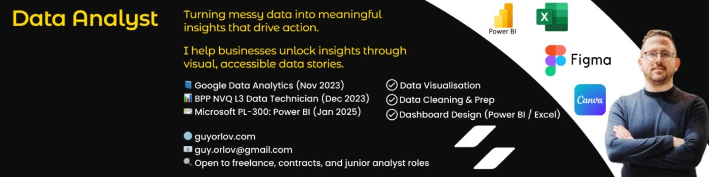

## About Me 👦
 
- 🤺 I&#39;m currently learning Python, SQL, Excel, Google Sheets and Power BI 👩‍💻. 
- 🎗 I&#39;m looking for open-source/internship opportunities. 
- 🎽 Find all my projects at [Guy Orlov](www.guyorlov.com) 
- 🎟 How to reach me [guy.orlov@gmail.com](guy.orlov@gmail.com)
 
## Some Certifications 🏆
 
- I’m a Certified Career Essentials in GitHub Professional Certificate via LinkedIn Learning 🏆. 
- I&#39;m a certified Google Data Analyst from Coursera 🏆.

## Skills 💪

<!-- Google Chrome  -->

<!-- MicrosoftSQLServer  -->

<!-- Microsoft Learn  -->

<!-- Microsoft Excel  -->

<!-- Power Bi  -->

<!-- WordPress  -->

<h2 align="center">📊 My Stats</h2>

 

<h3 align="center">Connect with me:</h3>

 
 
